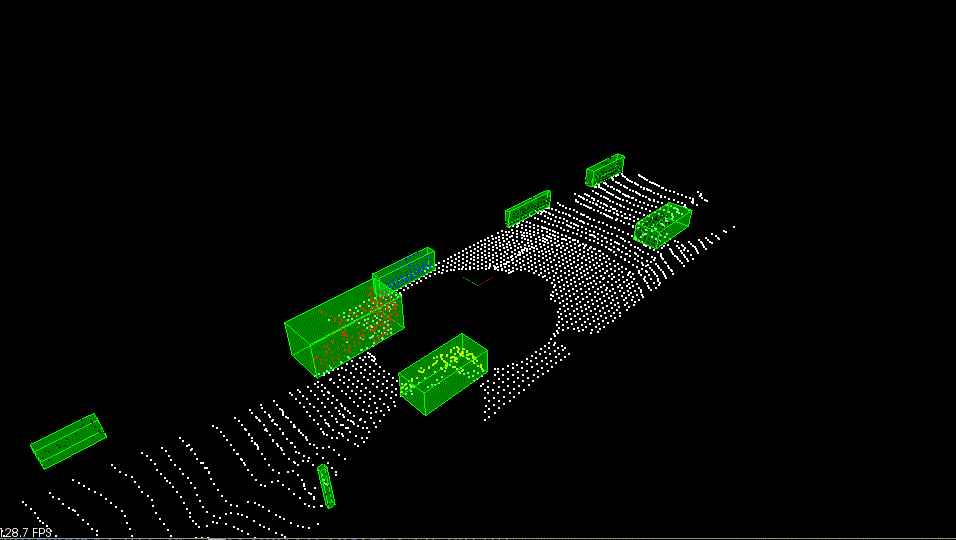
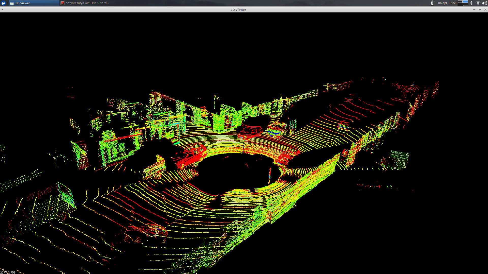
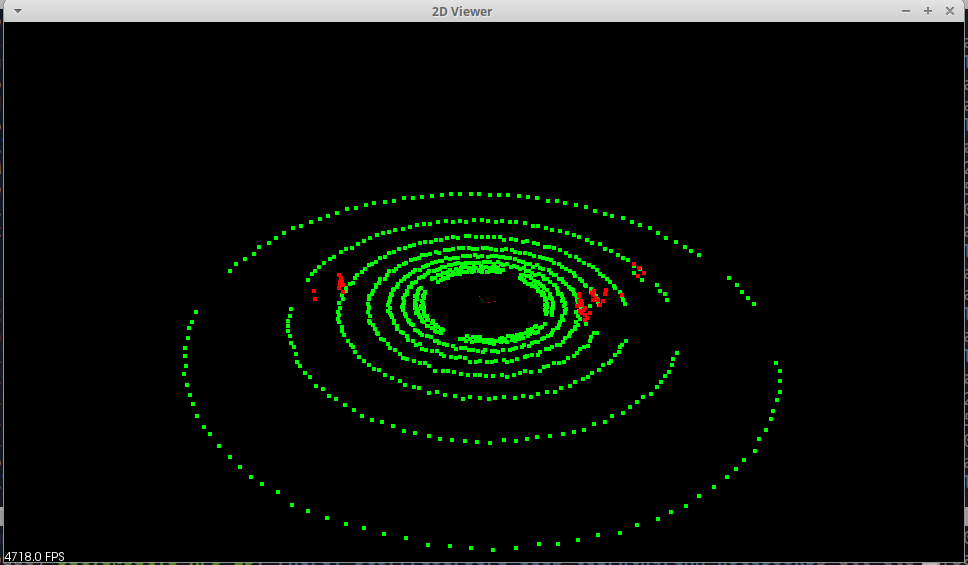
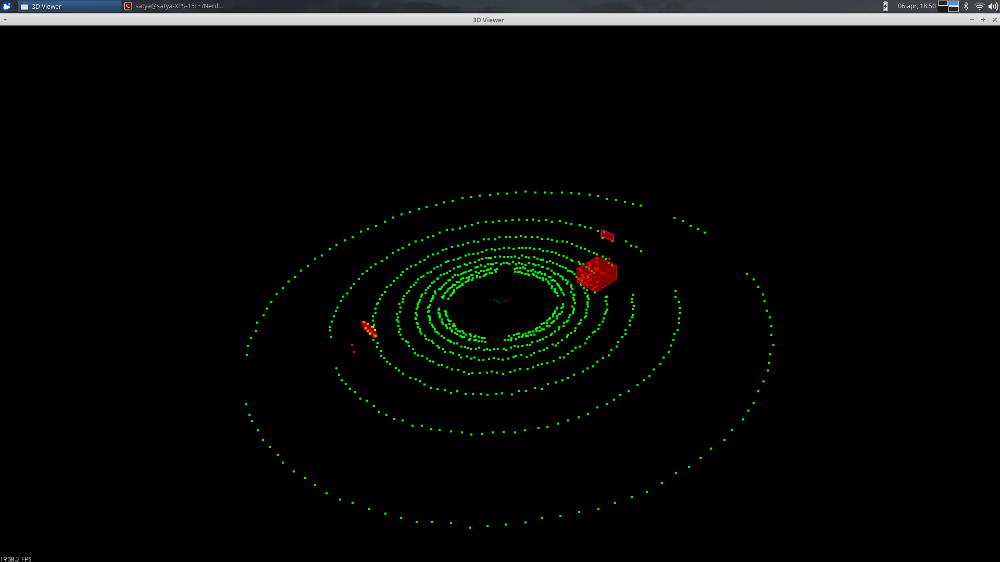
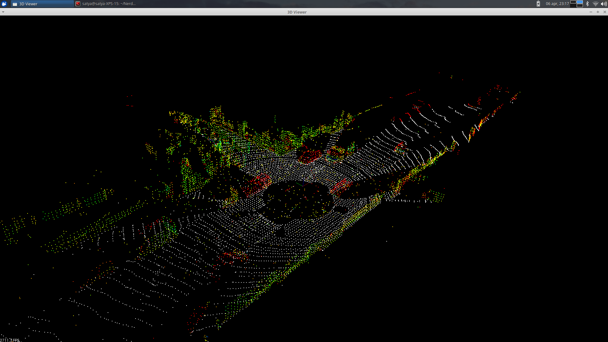
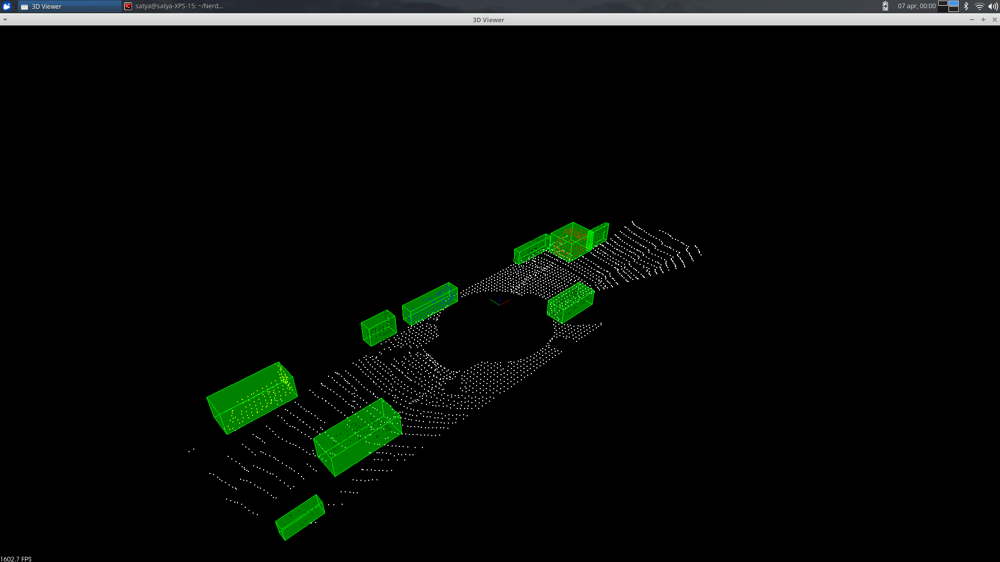

# Self-Driving Car Lidar Object detection

## Repo for the Lidar object detection project from the Sensor Fusion course for self-driving cars.

### Results

#### Clustering and bounding box prediciton on streamed point cloud data

#### Lidar data

#### RANSAC Ground plane segmentation

#### RANSAC Ground plane segmentation and clustering

#### Voxel grid filtering

#### Euclidian Clustering and bounding box prediction

